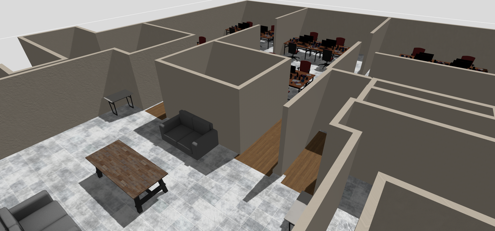

# Gazebo world collection



## :clipboard: Description

This repository hosts [Gazebo](https://gazebosim.org/home) simulation environments aka _worlds_.

## :clamp: Platforms

These worlds have been tested the following matrix:

- OS:
  - Ubuntu 22.04 Jammy Jellyfish
  - Ubuntu 24.04 Noble Numbat
- ROS 2:
  - Humble Hawksbill
  - Jazzy Jalisco
- Gazebo:
  - Fortress
  - Garden
  - Harmonic

## :rocket: Usage

Once built and sourced, package resources may be found under `<package-name>/models` and `<package-name>/worlds`, e.g.:

``` sh
gz sim -r gz-ekumen/worlds/populated_ekumen_hq4.world  # for Gazebo Garden and later versions
ign gazebo -r gz-ekumen/worlds/populated_ekumen_hq4.world  # for Gazebo Fortress and earlier versions
```

## :raised_hands: Contributing

Issues and PRs are always welcome! Please refer to the [CONTRIBUTING](CONTRIBUTING.md) guidelines.

## Code development

Note that [`docker`](./docker) containers are provided to ease workspace setup.
